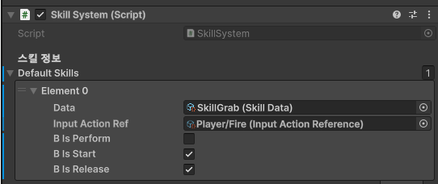
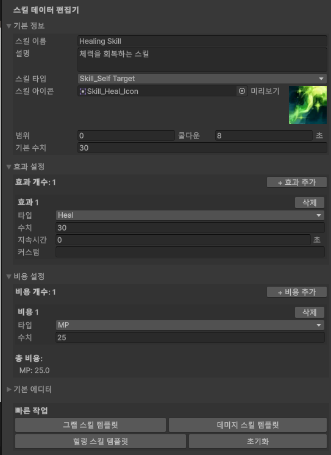

# SkillSystem 프로젝트 설명서

## 개요
SkillSystem은 확장 가능하고 데이터 기반의 스킬 시스템으로, 기획자가 수치와 옵션만 조정해서 다양한 스킬을 만들 수 있는 Unity 프레임워크입니다.

## 현재 적용 상태
 
- Player Actor 보유 스킬
  1. Skill_Grab (Mouse Left Button) : 마우스 방향으로 투사체 발사 후. 투사체가 다른 Actor Hit 시 시전자 앞으로 끌고옴
  2. Skill_Heal (Mouse Right Button) : 체력 회복
  

## 시스템 아키텍처

### 핵심 컴포넌트 구조
```
SkillSystem (MonoBehaviour)
├── Actor (MonoBehaviour) : 캐릭터 Actor
│   ├── HP/MP 관리
│   └── SkillSystem 참조
├── SkillData (ScriptableObject) : 스킬 정보 
│   ├── 스킬 기본 정보
│   ├── 효과 데이터 리스트
│   └── 비용 데이터 리스트
├── Skill (추상 클래스)     : 상세 스킬 구현
│   ├── Skill_SelfTarget
│   ├── Skill_Grab
│   └── 커스텀 스킬들
├── Effect (추상 클래스)    : 상세 이팩트 구현
│   ├── Effect_Damage
│   ├── Effect_Heal
│   ├── Effect_ShootProjectile
│   └── Effect_PullObject
├── EffectData (Serializable) : 이팩트 데이터
│   ├── 효과 타입
│   ├── 효과 수치
│   ├── 지속 시간
│   ├── 커스텀 데이터
│   └── 프리팹 참조
└── CostEffectData (Serializable) : 비용 데이터
    ├── 비용 타입
    └── 소모량
```

### 데이터 흐름
```
Input → SkillSystem → Skill → Effect → Actor
```

## 기본 설정

### 1. Actor 설정

```csharp
[RequireComponent(typeof(SkillSystem))]
public class Actor : MonoBehaviour
{
    [SerializeField] 
    private float curHP;
    [SerializeField] 
    private float maxHP;
    [SerializeField] 
    private float curMP;
    [SerializeField] 
    private float maxMP;
    
    [SerializeField] 
    private SkillSystem skillSystem;
    [SerializeField] 
    private Transform attackSocket; // 공격 생성 위치
    
    protected virtual void Awake()
    {
        skillSystem.InitializeActionSystem(this);
    }
}
```

**설정 단계:**
1. GameObject에 Actor 컴포넌트 추가
2. HP/MP 값 설정
3. AttackSocket Transform 할당 (공격 생성 지점)
4. SkillSystem 자동 생성됨

### 2. SkillSystem 설정
**이미지 첨부 필요**: SkillSystem Inspector의 defaultSkills 설정 화면  

```csharp
public class SkillSystem : MonoBehaviour
{
    [Header("스킬 정보")]
    [SerializeField]
    protected List<SkillDataWithInput> defaultSkills = new List<SkillDataWithInput>();
    
    [Serializable]
    public struct SkillDataWithInput
    {
        public SkillData Data;                      // 스킬 데이터
        public InputActionReference InputActionRef; // 입력 액션
        public bool bIsPerform;                     // performed 이벤트 사용
        public bool bIsStart;                       // started 이벤트 사용
        public bool bIsRelease;                     // canceled 이벤트 사용
    }
}
```

## 스킬 데이터 생성

### 1. SkillData ScriptableObject 생성

**생성 단계:**
1. Project 창에서 우클릭
2. Create → Skill ScriptableObject → SkillData
3. 파일명 지정

### 2. SkillData 설정


```csharp
[CreateAssetMenu(fileName = "New SkillData", menuName = "Skill ScriptableObject/SkillData")]
public class SkillData : ScriptableObject
{
    [Header("기본 정보")] 
    [SerializeField] 
    private ESkillTag skillTag;

    [SerializeField]
    private string skillName= "New Skill"; 
    
    [SerializeField]
    private string skillDescription ="스킬 설명"; 
    
    [Header("스킬 속성")]
    [SerializeField]
    private float range;
    [SerializeField]
    private float value;
    [SerializeField]
    private float cooldown;
    
    [Header("효과 설정")]
    [SerializeField]
    private List<EffectData> effects = new List<EffectData>();
    
    [Header("코스트 효과 설정")]
    [SerializeField]
    private List<CostEffectData> costEffectData = new List<CostEffectData>();
}
```

**설정 항목:**
- **Skill Tag**: 스킬 타입 (SelfTarget, Grab 등)
- **Skill Name**: 스킬 이름
- **Skill Description**: 스킬 설명
- **Range**: 스킬 범위
- **Value**: 기본 수치 (데미지, 힐량 등)
- **Cooldown**: 쿨다운 시간
- **Effects**: 적용될 효과들
- **Cost Effects**: 소모될 비용들

## 효과 시스템

### 1. EffectData 설정


```csharp
[System.Serializable]
public class EffectData
{
    [SerializeField]
    private EEffectType eEffectType;

    [SerializeField] 
    private float value;

    [SerializeField] 
    private float duration;

    [SerializeField] 
    private string customData;

    [SerializeField] 
    private GameObject prefab;
}
```

### 2. 지원하는 효과 타입
```csharp
public enum EEffectType
{
    Projectile,     // 투사체 발사
    Pull,           // 끌어오기
    Damage,         // 데미지
    Heal            // 회복
}
```

### 3. 효과 조합 예시

#### 대미지를 입히는 그랩스킬
```csharp
// 투사체 발사 효과
이미지 projectile

// 데미지 효과
프로젝타일에 넣은 effect
```

#### 힐링 스킬
```csharp
// 회복 효과
이미지
```

## 비용 시스템

### 1. CostEffectData 설정
```csharp
[System.Serializable]
public class CostEffectData
{
    [SerializeField]
    private ECostEffectType eCostEffectType;

    [SerializeField]
    private float value;
}

public enum ECostEffectType
{
    None = 0,
    HP,
    MaxHP,
    MP,
    MaxMP,
}

```

### 2. 비용 설정 예시
#### HP 5 소모, MP 20 소모


## 입력 시스템 연동

### 1. Unity Input System 설정


**설정 단계:**
1. Input Actions 에셋 생성
2. Action Maps 생성 
3. Actions 생성 
4. Binding 설정 

### 2. SkillSystem에 입력 연결
  
**생성한 Action들의 Reference를 SkillSystem에 반영**

**입력 이벤트 옵션:**
- **bIsPerform**: 키를 누르고 있을 때 Start Skill
- **bIsStart**: 키를 누르기 시작할 때 Start Skill
- **bIsRelease**: 키를 놓을 때 Complete Skill
```csharp
// SkillSystem의 defaultSkills에 추가
private void initializeSkillsBySkillData()
{
    if (defaultSkills == null || defaultSkills.Count == 0)
    {
        Debug.LogWarning($"{this.gameObject.name} {nameof(SkillSystem)} : No skills configured");
        return;
    }
    
    foreach (var skillData in defaultSkills)
    {
        if (skillData.Data != null)
        {
            if (!haveSkills.TryGetValue(skillData.Data.SkillName, out var skill))
            {
                skill = SkillFactory.CreateSkillBySkillTag(skillData.Data.SkillTag);
                if (skill == null)
                {
                    Debug.LogError($"{nameof(SkillSystem)} : Failed to create skill for tag {skillData.Data.SkillTag}");
                    continue;
                }
                haveSkills.Add(skillData.Data.SkillName, skill);
            }

            skill.InitializeSkill(ownerActor, skillData.Data,
                GameUtils.GetInputActionHash(skillData.InputActionRef.action));

            if (skillData.bIsPerform)
            {
                skillData.InputActionRef.action.performed += onInputPerformed;
            }

            if (skillData.bIsStart)
            {
                skillData.InputActionRef.action.started += onInputStarted;
            }

            if (skillData.bIsRelease)
            {
                skillData.InputActionRef.action.canceled += onInputCanceled;
            }
        }
        else
        {
            Debug.LogWarning($"{nameof(SkillSystem)} : Skill data is null in defaultSkills");
        }
    }
    
    Debug.Log($"{nameof(SkillSystem)} : Initialized {haveSkills.Count} skills");
}
```

## 커스텀 스킬 구현

### 1. 새로운 스킬 클래스 생성
```csharp
public class Skill_RangeAttack : Skill
{
    public override bool ApplySkill(Actor source, Actor target)
    {
        // Skill 자체 value 값으로 직접 대미지
        target.TakeDamage(source,ApplySkillData.value);
        
        // 이외 적용된 효과 적용
        OwnerSkillSystem.ApplyEffectsFromEffectData(ApplySkillData.Effects, source, target);
        
        CompleteSkill();
        return true;
    }
}
```
### 2. 새로운 스킬 태그 추가
```csharp
public enum ESkillTag
{
    Skill_SelfTarget,
    Skill_Grab,
    Skill_RangeAttack,  // 새로 추가
    Skill_Teleport,  // 새로 추가
    Skill_Shield     // 새로 추가
}
```

### 3. SkillFactory에 등록
```csharp
public static class SkillFactory
{
    public static Skill CreateSkillBySkillTag(ESkillTag eSkillTag)
    {
        switch (eSkillTag)
        {
            case ESkillTag.Skill_RangeAttack:
                return new Skill_RangeAttack();
            case ESkillTag.Skill_SelfTarget:
                return new Skill_SelfTarget();
            case ESkillTag.Skill_Grab:
                return new Skill_Grab();
            default:
                return new Skill_SelfTarget();
        }
    }
}
```

## 커스텀 이펙트 구현

### 1. 새로운 이펙트 클래스 생성
```csharp
public class Effect_Burn : Effect
{
    private float burnDuration;
    private float burnTick;
    
    public Effect_Burn(SkillSystem skillSystem, EffectData inEffectData) : base(skillSystem, inEffectData)
    {
        burnDuration = effectData.Duration;
        burnTick = 0f;
    }
    
    public override void Apply(Actor source, Actor target)
    {
        if (target != null)
        {
            bIsRunning = true;
            burnTick = 0f;
            Debug.Log($"[{nameof(Effect_Burn)}] {target.name} is burning!");
        }
    }
    
    public override void Update(float deltaTime)
    {
        if (!bIsRunning) return;
        
        burnTick += deltaTime;
        
        // 1초마다 데미지
        if (burnTick >= 1f)
        {
            burnTick = 0f;
            target?.TakeDamage(source, effectData.Value);
        }
        
        // 지속 시간 종료
        if (burnTick >= burnDuration)
        {
            EndEffect();
        }
    }
}
```

### 2. EffectFactory에 등록
```csharp
public static class EffectFactory 
{
    public static Effect CreateEffect(SkillSystem skillSystem, EffectData effectData)
    {
        switch (effectData.EffectType)
        {
            case EEffectType.Burn:
                {
                    return new Effect_Burn(skillSystem, effectData);
                }
            case EEffectType.Damage:
                {
                    return new Effect_Damage(skillSystem, effectData);
                }
            case EEffectType.Heal:
                {
                    return new Effect_Heal(skillSystem, effectData);
                }
            case EEffectType.Projectile:
                {
                    return new Effect_ShootProjectile(skillSystem, effectData);
                }
            case EEffectType.Pull:
                {
                    return new Effect_PullObject(skillSystem, effectData);
                }
            default:
                {   
                    return new Effect_Default(skillSystem, effectData);
            |   }
        }
    }
}
```

### 3. EEffectType enum에 추가
```csharp
public enum EEffectType
{
    Projectile,     // 투사체 발사
    Pull,           // 끌어오기
    Damage,         // 데미지
    Heal,           // 회복
    Burn            // 새로 추가 - 화상
}
```

## 기타 기능

### 1. 조건부 스킬 실행
```csharp
public override bool CanApplySkill()
{
    if (!base.CanApplySkill())
        return false;
    
    // 추가 조건 검사
    if (OwnerActor.CurHP < OwnerActor.MaxHP * 0.3f)
    {
        Debug.Log("HP가 30% 이하일 때만 사용 가능한 스킬");
        return false;
    }
    
    return true;
}
```

### 2. 동적 스킬 추가/제거
```csharp
// 런타임에 스킬 추가
public void AddSkill(SkillData skillData, InputActionReference inputAction)
{
    var skill = SkillFactory.CreateSkillBySkillTag(skillData.SkillTag);
    skill.InitializeSkill(OwnerActor, skillData);
    haveSkills.Add(skillData.SkillName, skill);
}

// 스킬 제거
public void RemoveSkill(string skillName)
{
    if (haveSkills.ContainsKey(skillName))
    {
        haveSkills.Remove(skillName);
    }
}
```

### 3. ObjectPool 연동


```csharp
// GameUtils Pool을 이용해 GameObject를 받아오는 기능
public static GameObject GetGameObjectFromPool(string poolName, Vector3 position, Quaternion rotation, GameObject defaultPrefab)
{
    // ObjectPoolManager가 없으면 기존 방식 사용
    if (ObjectPoolManager.Instance == null)
    {
        Debug.LogWarning($"{nameof(Effect_ShootProjectile)} : ObjectPoolManager not found, using Instantiate");
        return GameObject.Instantiate(defaultPrefab, position, rotation);
    }
    
    // 풀이 존재하지 않으면 런타임에 생성
    if (!ObjectPoolManager.Instance.PoolExists(poolName))
    {
        ObjectPoolManager.Instance.CreateRuntimePool(poolName, defaultPrefab, 10, 50);
    }
    
    return ObjectPoolManager.Instance.Get(poolName, position, rotation);
}
```
## 커스텀 에디터 스크립트

### 1. SkillDataInspectorEditor

SkillData ScriptableObject를 위한 커스텀 Inspector 에디터로, 기획자가 쉽게 스킬을 편집할 수 있도록 설계됨.

#### 주요 기능

**기본 정보 섹션**
- 스킬 이름, 설명, 타입 편집
- **스킬 아이콘 설정**: UI에서 사용할 스프라이트 아이콘 지정
- **아이콘 미리보기**: 64x64 크기로 실시간 미리보기 제공
- 범위, 쿨다운, 기본 수치 설정

**효과 설정 섹션**
- 효과 개수 표시 및 관리
- 효과 추가/삭제 버튼
- 각 효과별 상세 설정:
  - 효과 타입 (Damage, Heal, Projectile, Pull)
  - 효과 수치
  - 지속 시간
  - 커스텀 데이터

**비용 설정 섹션**
- 비용 개수 표시 및 관리
- 비용 추가/삭제 버튼
- **중복 방지 시스템**: 동일한 비용 타입 중복 설정 방지
- **최대 개수 제한**: ECostEffectType 개수에 따른 자동 제한

**빠른 작업 섹션**
- **템플릿 시스템**: 그랩, 데미지, 힐링 스킬 템플릿 제공
- **초기화 기능**: 해당 스킬 데이터를 기본값으로 리셋
- **Undo 지원**: 모든 작업에 Undo/Redo 지원

#### 사용 방법

1. **SkillData 선택**: Project 창에서 SkillData ScriptableObject 선택
2. **섹션 접기/펼치기**: 각 섹션의 화살표로 접기/펼치기 가능
3. **아이콘 설정**: "스킬 아이콘" 필드에 스프라이트 드래그 앤 드롭
4. **효과 추가**: "+ 효과 추가" 버튼으로 새로운 효과 생성
5. **비용 추가**: "+ 비용 추가" 버튼으로 새로운 비용 생성
6. **템플릿 적용**: "빠른 작업" 섹션의 템플릿 버튼으로 빠른 설정